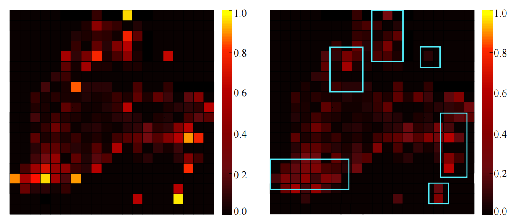
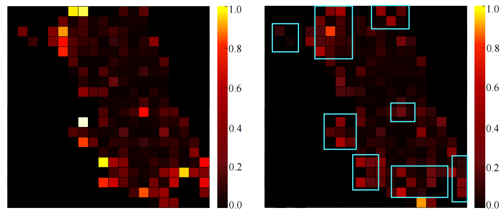

# Real-Time Forecasting of Traffic Accidents Across Multiple Cities Using Self-Supervised Learning on Large-Scale Spatiotemporal Data


<!-- -->

## Installation

<!-- <details><summary>Click to expand</summary> -->

### 1. Create conda environment

<!-- <details><summary>Instructions</summary> -->

```bash
conda create --name SSL-eKamba python=3.11
conda activate SSL-eKamba
```

Install [PyTorch 2.1.1](https://pytorch.org/) inside the conda environment, and install the following files:

```bash
conda install --file requirement.txt 
pip install -r requirement.txt
```


</details>

### 2. Datasets
You can download the datasets from [**"New York City "**](https://opendata.cityofnewyork.us)
 and [**"Chicago"**](https://data.cityofchicago.org).


## Model training and Evaluation
If the environment and datasets are ready, please run the following commands to train the model on the specific dataset from {nyc, chi }.
<!-- <details><summary>Click to expand</summary> -->

```bash
>> cd SSL-ekamba
>> ./runme 0 nyc   # 0 specifies the GPU id
```
